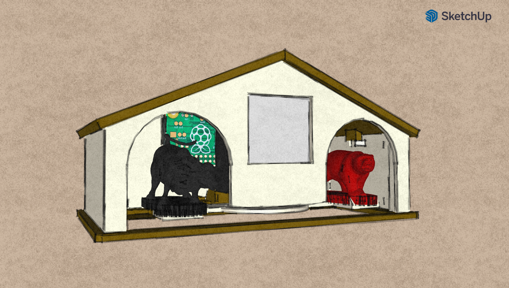

# bullandbearhouse
Weather House with Bull and Bear



## Hardware
* Raspberry Pi Zero W (or any other RPi)
* Waveshare eInk display (supports multiple versions)
* Servo

## Installation
1. Turn on SPI via `sudo raspi-config`
    ```
    Interfacing Options -> SPI
   ```
2. Install eInk display drivers and dependencies
    ```
    sudo apt update
    sudo apt-get install python3-pip python3-pil
    pip3 install RPi.GPIO spidev
    git clone https://github.com/waveshare/e-Paper.git ~/e-Paper
    pip3 install ~/e-Paper/RaspberryPi_JetsonNano/python/
    ```
    for more information refer to: https://www.waveshare.com/wiki/2.13inch_e-Paper_HAT
3. Download BullAndBearHouse program
    ```
    git clone https://github.com/ronnyagous/bullandbearhouse.git ~/bullandbearhouse
    ```
4. Run it 
    ```
    python3 ~/bullandbearhouse/main.py
    ```
5. To make it run on startup
    1. `sudo nano /etc/rc.local` 
    2. Add one the following before `exit 0`
    ```
    /usr/bin/python3 /home/pi/bullandbearhouse/main.py &
    ```

 6. To make it look for WPS WiFi connection on startup
    1. `sudo nano /etc/rc.local` 
    2. Add one the following before `exit 0`
    ```
    # Print the IP address
    _IP=$(hostname -I) || true
    if [ "$_IP" ]; then
      printf "My IP address is %s\n" "$_IP"
    else
      printf "No IP address - trying WPS\n"
      wpa_cli wps_pbc -i wlan0
    fi    
    ```

The following screens are supported:
* epd1in54_V2
* epd1in54b_V2
